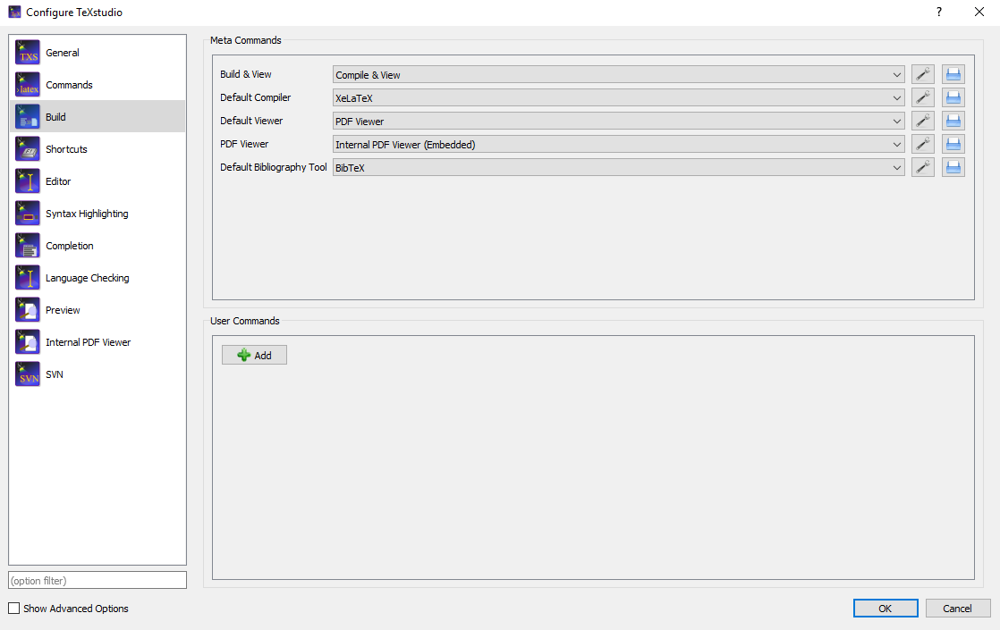

# LaTeX编辑器编辑中文乱码问题

## 故障描述
有时候，我们使用TeXstudio或TeXmaker等编辑器编辑中文PDF会出现乱码问题：

代码:
```
\documentclass{article}
\usepackage{ctex}
\begin{document}
	你好
\end{document}
```
## 故障解决
解决Texstudio/其他Tex编辑器编译出PDF中文显示乱码问题:
本文只示例TeXstudio, 其他编辑器相似，在此不做演示.

1. 菜单栏找到 **compiler**

点击 ```options```, ```configure TeXstudio``` , ```build```, 更改 Default compiler ```XeLaTeX``` 


2. 再次点击 ```Build & View``` .

Code:
```
\documentclass{article}
\usepackage{ctex}
\begin{document}
	你好
\end{document}
```
