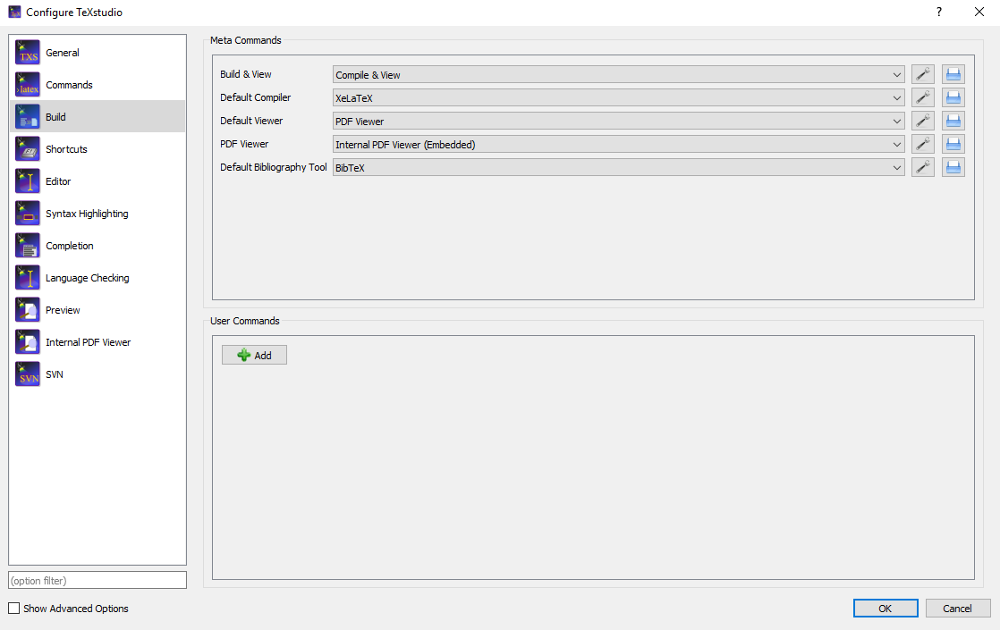

## Problem of TeX code editor display Chinese PDF garbled

### Description
Some times, we use TeX Studio or other editor to coding TeX, the PDF view Chinese is garbled, like this:


Code:
```
\documentclass{article}
\usepackage{ctex}
\begin{document}
	你好
\end{document}
```
### Solution
Solve PDF Chinese display garbled in Texstudio problem:
Other editors is similar.

1. Change the **compiler** in the Menu Bar.
If the editor is TeXstudio:
Click ```options```then, ```configure TeXstudio``` , ```build```, select Default compiler ```XeLaTeX``` 


2. Click ```Build & View``` again.


Code:
```
\documentclass{article}
\usepackage{ctex}
\begin{document}
	你好
\end{document}
```
